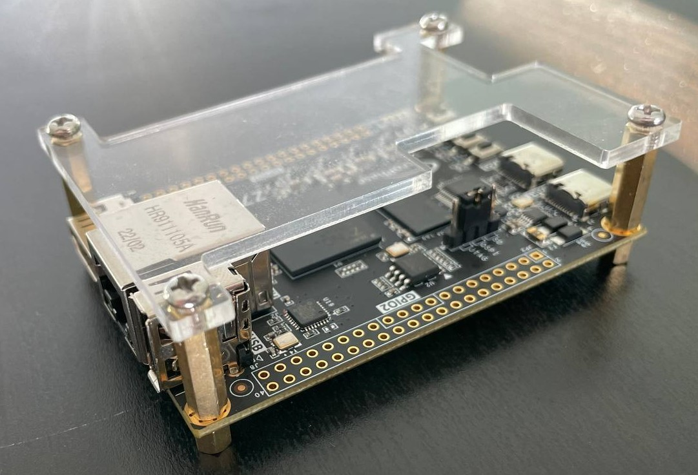
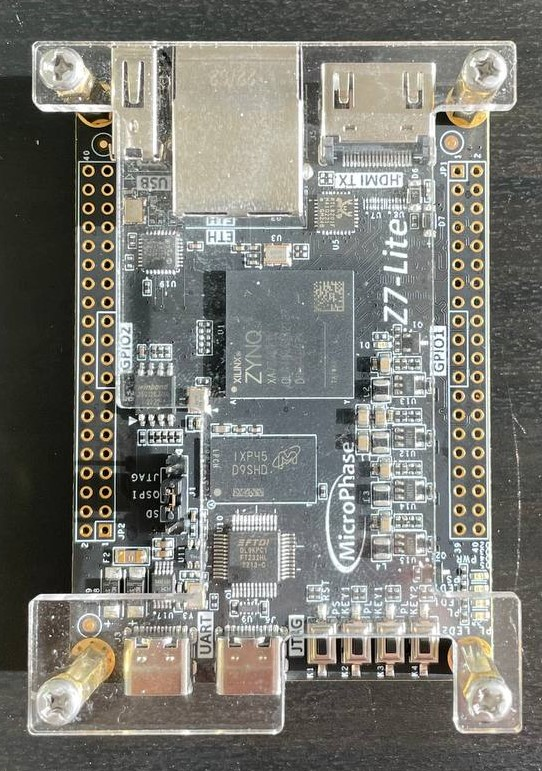
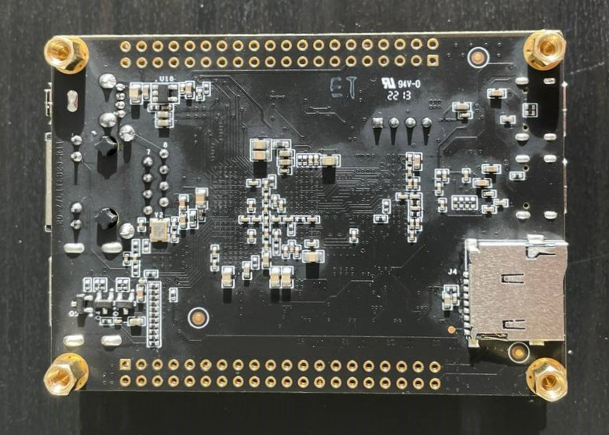

# MicroPhase z7-Lite

source files for MicroPhase Z7 Lite board, [AliExpress-avaliable](https://aliexpress.ru/item/1005002542001122.html?spm=a2g2w.orderdetail.0.0.45344aa6H0Hokr&sku_id=12000021066812071).

 

## Board features

- Zynq 7010/20 (xc7z020clg400-2)
- microSD card slot (PS)
- 4Gbit DDR3 MT41J256M16 RE-125 (PS)
- USB Host 3320C-EZK(PS)
- Winbond 16MB QSPI Flash W25Q128JVSIQ (PS)
- HDMI Output (PL)
- Ethernet RTL8201F (PL)
- Leds and Buttons (PS/PL)
- USB type-C UART to ZYNQ
- USB type-C JTAG
- two GPIO 2x20
- full of examples from AliExpress-seller (Vivado 2018.3, need to be requested)

## Project list
All projects created in non-project mode with Vivado 2023.1.

- PS templates
  - [`01_pure_eth`](/01_pure_eth/) - connecting RTL8201 to PS-Ethernet controller through EMIO
  - [`02_custom_axi_slave`](/02_custom_axi_slave/) - Adding custom low-spee AXI peripheral for data gathering and streaming via Ethernet

## TODO

- [ ] Vivado example project for PL part
- [ ] Vivado example project for PS part
- [ ] Vitis example project for PS part (tbd)
